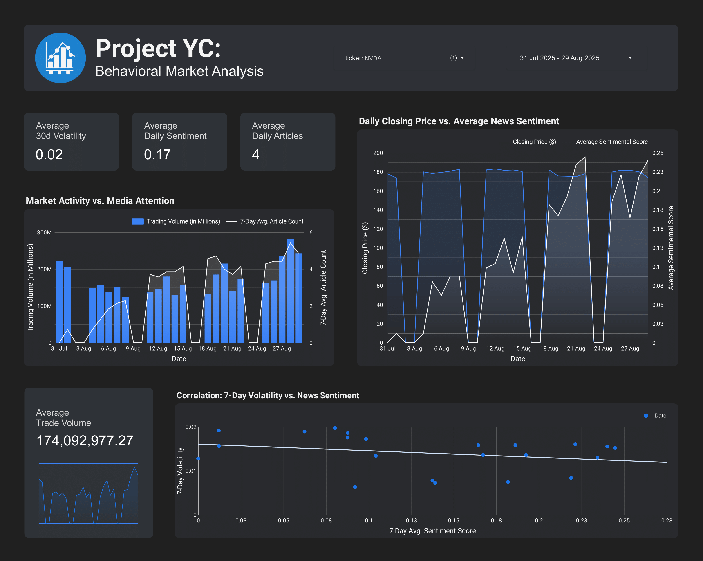

# Project Titan: Behavioral Market Analysis

An end-to-end data analytics project investigating the relationship between public sentiment (news articles) and stock market behavior (price, volume, and volatility).

[](https://opensource.org/licenses/MIT)

---

## 📊 Live Dashboard

**Explore the interactive dashboard built with Looker Studio:**

[**➡️ Live Project Titan Dashboard**](https://your-looker-studio-link-here.com)

*(Note: The dashboard is built on a static, exported dataset. The full automated pipeline was developed locally.)*

---

## 📜 Project Overview

This project tests the hypothesis that shifts in public attention and media sentiment can serve as leading indicators for stock market volatility and trading volume. By ingesting, processing, and analyzing data from financial markets and news APIs, this project aims to uncover correlations and build a tool for behavioral market analysis.

The entire data pipeline, from ingestion to transformation, was built locally using a modern analytics stack. The final, cleaned dataset was then used to power an interactive executive dashboard for exploration and insight generation.

---

## ✨ Key Features & Insights

* **End-to-End Data Pipeline:** A complete, locally-run pipeline that collects data using Python, transforms it with dbt, and visualizes it in Looker Studio.
* **Advanced Analytics:** Calculation of key financial metrics including 30-day rolling volatility, 7-day rolling averages for sentiment and news volume, and daily returns.
* **Insight 1:** A slight negative correlation was observed between the 7-day average news sentiment and market volatility for several tech stocks, suggesting that periods of more positive news coverage may align with more stable market conditions.
* **Insight 2:** The 7-day average article count proved to be a strong indicator of market activity, with significant spikes in media attention often preceding surges in trading volume.

---

## 📸 Dashboard Preview

Here are some previews of the dashboard analyzing different company data.

#### **NVIDIA (NVDA) Analysis**
*(A look at the relationship between closing price and the 7-day average sentiment score.)*


#### **Tesla (TSLA) Analysis**
*(Examining the correlation between market activity and media attention.)*


---

## 🛠️ Tech Stack & Architecture

This project utilizes a modern, local-first data stack.

* **Data Ingestion:** **Python** (`yfinance`, `newsapi-python`)
* **Data Transformation:** **dbt (data build tool)**
* **Local Data Warehouse:** **DuckDB**
* **Data Visualization:** **Google Looker Studio**
* **Development Environment:** **JupyterLab**, **VS Code**

### Project Workflow
1.  **Ingestion:** Python scripts located in `scripts/extraction/` are run to collect 10 years of stock market data and 30 days of news headlines, saving them as CSV files to the `data/raw/` directory.
2.  **Transformation:** dbt connects to the local DuckDB instance, reads the raw CSVs from `data/raw/`, and runs a series of SQL models to clean, join, and calculate advanced metrics.
3.  **Export & Visualization:** A Python script in `scripts/analysis/` exports the final, transformed table from DuckDB to a clean CSV in the `data/processed/` directory. This file is then uploaded to Google Sheets to power the Looker Studio dashboard.

---

## ⚠️ Data Limitations

* **News API Data:** Due to the limitations of the free tier of the NewsAPI, the sentiment and article count data is restricted to the most recent 30 days (July 31, 2025 – August 29, 2025). As a result, direct sentiment analysis is focused on this period.

---

## 🚀 How to Run Locally

To replicate this project, clone the repository and set up the environment.

1.  **Clone the repository:**
    ```bash
    git clone [https://github.com/your-username/project-titan.git](https://github.com/your-username/project-titan.git)
    cd project-titan
    ```
2.  **Install dependencies:**
    ```bash
    pip install -r requirements.txt
    ```
3.  **Run the ingestion scripts:**
    * Add your NewsAPI key to `scripts/extraction/3_get_news_sentiment.py`.
    * Run the Python scripts from the main project folder:
    ```bash
    python scripts/extraction/1_get_market_data.py
    python scripts/extraction/2_get_google_trends.py
    python scripts/extraction/3_get_news_sentiment.py
    ```
4.  **Run the dbt project:**
    ```bash
    cd dbt_project
    dbt build
    ```
5.  **Export the final data:**
    * While still inside the `dbt_project` folder, run:
    ```bash
    python ../scripts/analysis/4_export_final_data.py
    ```
    The final dataset will be available at `data/processed/final_analytics_data.csv`.

---
